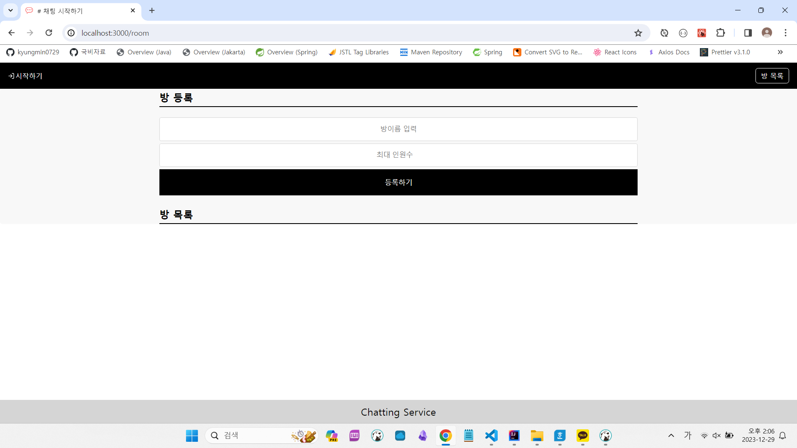
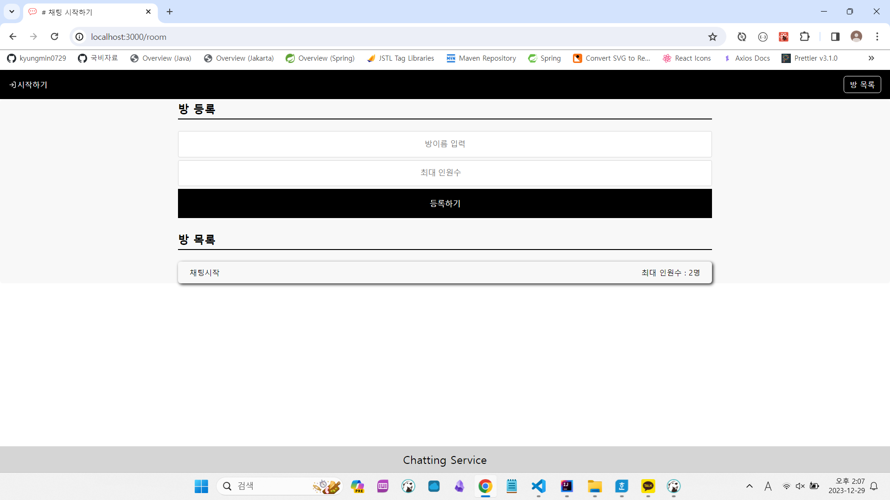
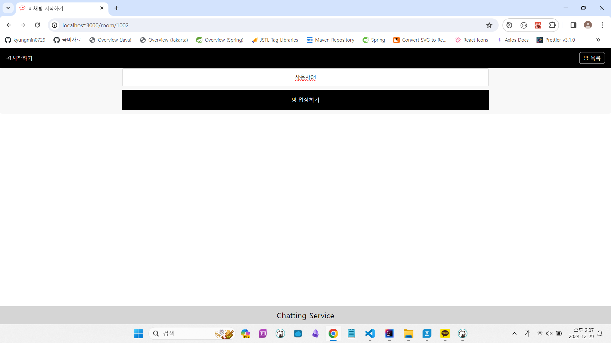
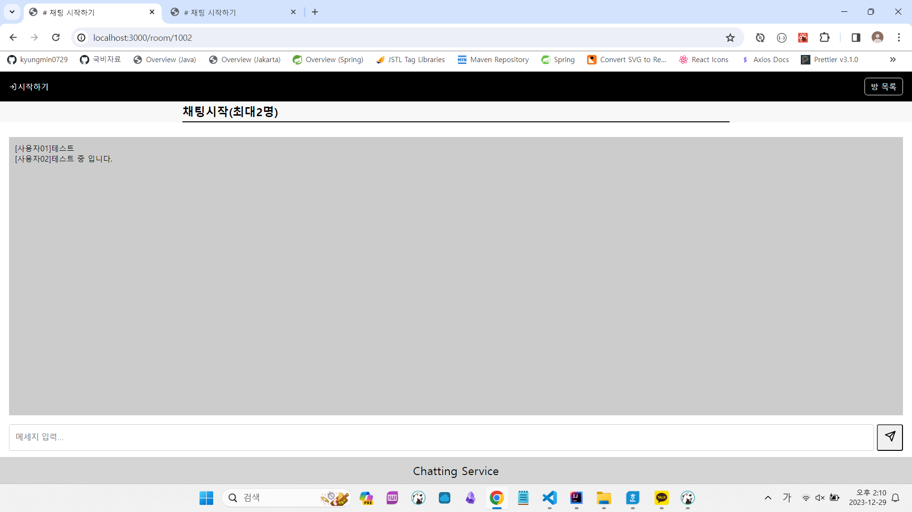

# 프로젝트 명

- 채팅 프로그램 포트폴리오

## 프로젝트 개요

## 기술 스택

### Springboot

- Websocket을 사용하여 실시간으로 채팅 메세지를 보내고 받는 기능 구현

### React.js

- apiRequest 함수를 구현하여 간편하게 API 요청을 보낼 수 있도록 했습니다. 또한, .env파일로 정의하여 React 애플리케이션에서 사용할 환경 변수를 설정하여 중요한 정보를 보관하고 다른 환경에서 실행할 때마다 변경할 필요 없이 사용할 수 있도록 도와주는 역할
